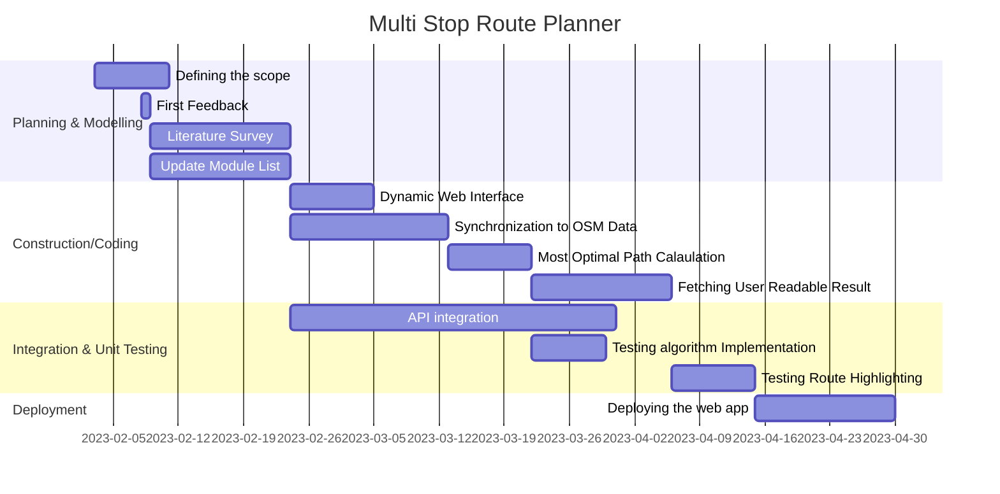
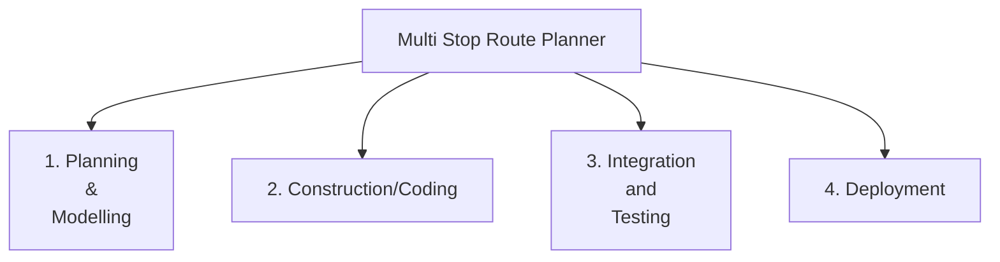
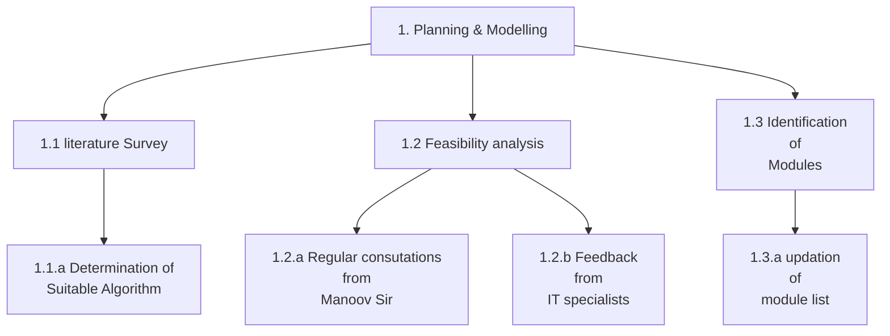
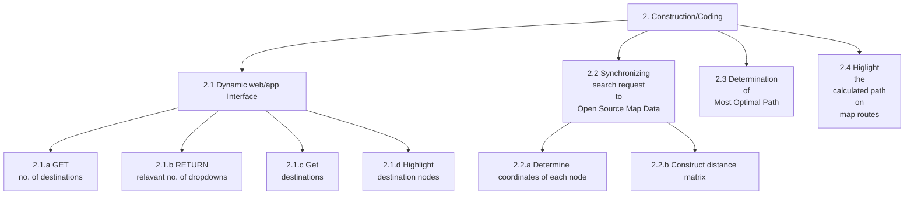
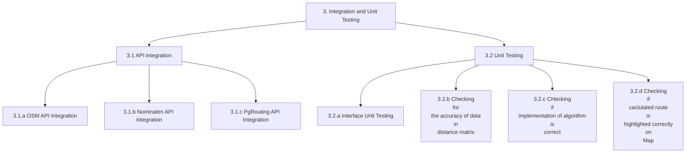
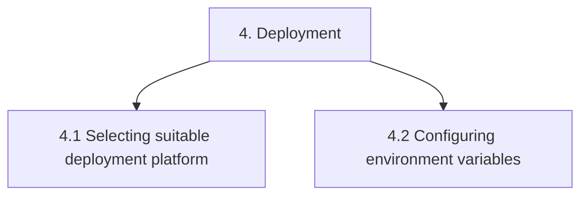

# Destiny-Defined_TARP

### Project Title 

Mutli Destination Most Optimal Route Planner

### Objective
We wish to build a web app that would enable tourists who may wish to travel to multiple destinations in a new city to navigate the shortest route without passing the same street twice. This would prove to be really useful in travel planning. 

### Development Model

Iterative Waterfall 
 
In this process model, the development process is divided into several phases such as requirement gathering, design, coding, testing and deployment.
Each phase is executed only when the previous phase is completed, so it is a step by step process without parallelism.
It is suitable for small scale projects with low risks, when quality is preferred over cost and requirements are well-known upfront.
The iterative nature provides for error correction at the end of each phase leading to less errors in the final testing phase.

### Roles and Responsibilities

1. Dynamic Web Interface: Prakhar Goyal (20BCE2211) and Harshit Jaiswal (20BCE2157)
2. Synchronizing search request to open source Map Data: Pranjal Choudhary (20BCE0571) and Anmol Gupta (20BCB0135)
3. Determination of most optimal Path : Vivek Rathore (20BCE0573) and Aditya Singh Rathore (20BCE0730)
4. Highlighting the calculated route on GMaps : Rama Krishna Mohapatro (20BCE0877) and Pallav Jyoti Buragohain (20BCE0866)
5. <i><b>Note:</b> Visit [here](Workflow.md) to checkout the workflow</i>

### FlowChart

### Gantt Chart

### Activity-based Work Breakdown Structure

### Software Requirements

#### 1. Dependencies
 - mermaid-js (for documentation)
 - HTML, Tailwind CSS and Vanilla Javascript (For dynamic web UI)
 - Nominatim API (Allows geocoding and reverse geocoding which in turn allows to both search a coordinate by name as well as find the coordinates of a destination to determine the closest nodes/destinations tot that destination)
 - Leaflet Library (Mobile friendly interactive maps)
 - OpenChargeMap API (allows access to open data registry of EV charging points)
 - OpenStreetMap API (allows us to use OSM database)

#### 2. Databases
 - OpenStreetMap (OSM) - PostgreSQL based

    

 - pgRouting (Represents the city as a weighted graph and helps implement several routing algorithms)

#### 3. Development Environment 

Code Editor: VS Code 
MarkDown Editor : Obsidian 
Browser: Chrome(majorly) 
Graphics Editor: Figma, Adobe Photoshop 
FTP Client: FileZilla, CyberDuck 
Version Control: Git 
Module Integration: Github

### Hardware Requirements

Operating System: Windows 8 or later 
Processor: Intel Pentium 4 or later 
Memory: 2GB minimum, 4GB recommended 
Screen Resolution: 1280X1024 or larger 
Internet upstream Bandwidth: 2Mbps or more 
Browser: Chrome/Edge/Firefox

### Literature Survey
|  Title  |  Author  |  Algorithm and dataset  |  Important Findings  |  Limitations  |
| --- | --- | --- | --- | --- |
| Route planning for blind pedestrians using OpenStreetMap | Achituv Cohen and Sagi Dalyot |The workflow to create a weighted network graph was generated by utilizing ESRI’s ArcGIS ModelBuilder and Python scripts .Similar to the existing route optimization research for disabled people, the Dijkstra algorithm was used. OSM map data are converted into ArcGIS Feature Class (FC) objects. Features intended for pedestrians walking having the value key “highway” form the GraphWays .Road features that must be avoided by blind pedestrians are stored in a different FC, used to calculate added costs and restriction intersections, and are presented as restriction network lines on the network graph. some streets on the OSM map, which are navigational, are displayed as polygons. To amend the polygon elements to linear ones that are later added to the network, we developed a skeleton algorithm using a Thiessen polygon structure, and geometric and topologic rules. | This study presented a methodology that uses OSM data, as well as designing a tailored set of criteria, for generating optimal walking routes for blind pedestrians. Focus is placed on generating routes that are safe and easy to navigate. Qualitative evaluations showed how  developed system and algorithm tend to select a safer and easier route to navigate, preferring more accessible paths while avoiding dangerous locations.| OSM has some shortcomings, mainly in terms of data quality ( accuracy and topological errors) and completeness. |
| Handling OpenStreetMap georeferenced data for route planning | Soraia Fel´ıcioa, Joana Horaa, Marta Campos Ferreiraa, Diogo Abrantesb, Paulo Dias Costab, Camila Dangeloa, Jorge Silvad, Teresa Galvao |The algorithm used here is the A-star algorithm to determine the route, which applies a best-first search to find the optimal path from the source vertex to the target. The formulation is made in terms of weighted graphs, considering a specified cost for each edge. This algorithm keeps a tree of paths from the source vertex, which is extended one edge at a time until its termination criterion is satisfied. In each iteration, the A-star algorithm chooses which path to extend. A-star ends the iterative process when the path it chooses to extend is a path from the source vertex to the target or when there are no paths eligible to be extended. | This study makes a contribution by improving the OSM data model by including a multi-criteria dimension for route planning, as well as by supporting the process of dealing with geographical data and routing algorithms.| Effectiveness of the A* algorithm are heavily dependent on the quality of the heuristic function used to estimate the distance between the current node and the goal node. If the heuristic function is not well-designed, the algorithm may not find the optimal path, or it may take longer to converge. |
| Real-Time Routing with OpenStreetMap data | Dennis Luxen, Christian Vetter | First, the geometry is generalized according to the zoom level using a heuristic variant of the classic Douglas-Peucker algorithm that can be implemented to run in O(n log n) time . Second, a string of longitude and latitude coordinate pairs is highly compressible. We implement the Google Maps Encoded Polyline Algorithm Format which is simple and offers great compression rate. | They show how to use OSM data with both a server-based approach and a handheld device.These programmes offer precise and real-time shortest path computation on networks the size of continents with millions of street segments. In-depth real-time capabilities like draggable routes and round-trip planning are also shown. | The greatest limitation of handheld devices comes from a limited I/O bandwidth to the flash memory.|

### References

##### Scholarly References
- Huang, Y., Ying, J. J. C., Yu, P. S., & Tseng, V. S. (2020). Dynamic graph mining for multi-weight multi-destination route planning with deadlines constraints. ACM Transactions on Knowledge Discovery from Data (TKDD), 15(1), 1-32. [[doi link]](https://doi.org/10.1145/3412363)
- Chowdhury, S., & Giacaman, N. (2015). En-route planning of multi-destination public-transport trips using smartphones. Journal of Public Transportation, 18(4), 31-45. [[doi link]](https://doi.org/10.5038/2375-0901.18.4.3)
- Hakeem, A., Gehani, N., Ding, X., Curtmola, R., & Borcea, C. (2019, November). Multi-destination vehicular route planning with parking and traffic constraints. In Proceedings of the 16th EAI International Conference on Mobile and Ubiquitous Systems: Computing, Networking and Services (pp. 298-307) [[doi link]](https://doi.org/10.1145/3360774.3360824)
- Nanayakkara, S. C., Srinivasan, D., Lup, L. W., German, X., Taylor, E., & Ong, S. H. (2007, September). Genetic algorithm based route planner for large urban street networks. In 2007 IEEE Congress on Evolutionary Computation (pp. 4469-4474). IEEE [[doi link]](https://doi.org/10.1109/CEC.2007.4425056)
- Edelkamp, S., Jabbar, S., & Willhalm, T. (2005). Geometric travel planning. IEEE Transactions on Intelligent Transportation Systems, 6(1), 5-16. [[doi link]](https://doi.org/10.1109/TITS.2004.838182)

##### Web References
- https://pgrouting.org/
- https://www.openstreetmap.org/
- https://developers.google.com/maps/documentation/javascript/distancematrix
- https://www.w3schools.com/graphics/google_maps_basic.asp
- https://www.upperinc.com/blog/what-is-multi-stop-route-planning/
- https://pretalx.com/sotm-africa-2021/talk/7YHERU/
- https://memgraph.com/blog/how-to-build-a-route-planning-application-with-breadth-first-search-and-dijkstras-algorithm
- https://towardsdatascience.com/driving-distance-between-two-or-more-places-in-python-89779d691def

##### Learning Resources
- [Markdown cheatsheet for preparing Readme.md](https://github.com/christianlempa/cheat-sheets/blob/main/misc/markdown.md)
- [How to use an API tutorial](https://www.youtube.com/watch?v=WXsD0ZgxjRw)
- [pgRouting Workshop - Self Study](http://workshop.pgrouting.org/2.8/en/index.html)
- [Using OpenStreetMAP data with pgRouting](https://medium.com/@frederic.rodrigo/imposm2pgrouting-route-planning-on-openstreetmap-road-network-with-the-benefit-of-updates-1e70f280ac5e)
- [Loading data from OpenStreet Map API](https://towardsdatascience.com/loading-data-from-openstreetmap-with-python-and-the-overpass-api-513882a27fd0)

