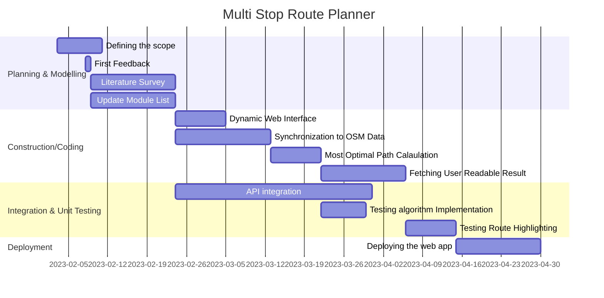
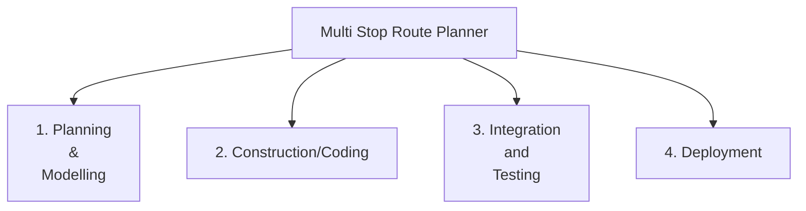
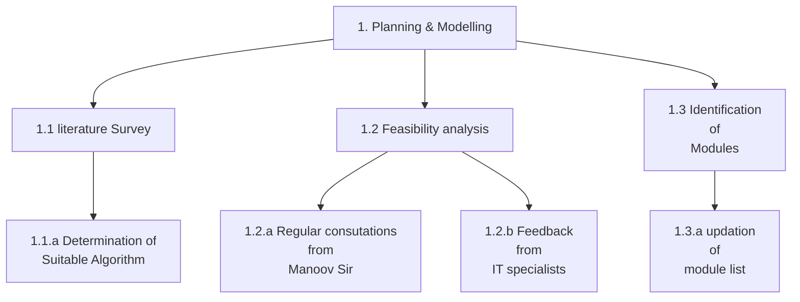
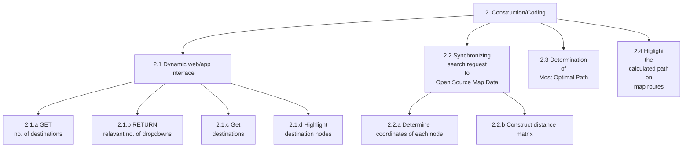
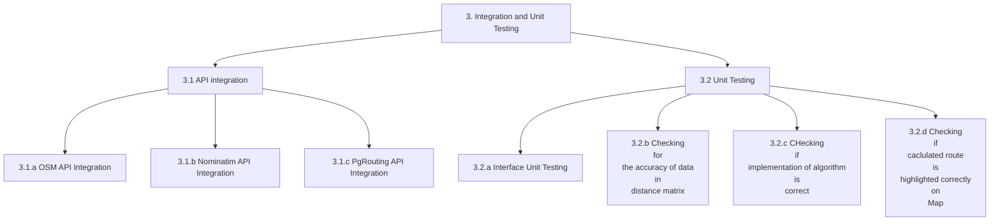
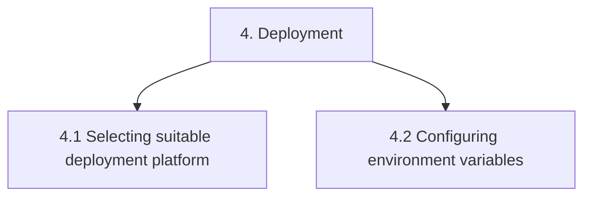

# Destiny-Defined_TARP

### Project Title 

Mutli Destination Most Optimal Route Planner

### Objective
We wish to build a web app that would enable tourists who may wish to travel to multiple destinations in a new city to navigate the shortest route without passing the same street twice. This would prove to be really useful in travel planning. 

### Development Model

Iterative Waterfall 
 
In this process model, the development process is divided into several phases such as requirement gathering, design, coding, testing and deployment.
Each phase is executed only when the previous phase is completed, so it is a step by step process without parallelism.
It is suitable for small scale projects with low risks, when quality is preferred over cost and requirements are well-known upfront.
The iterative nature provides for error correction at the end of each phase leading to less errors in the final testing phase.

### Roles and Responsibilities

1. Dynamic Web Interface: Prakhar Goyal (20BCE2211) and Harshit Jaiswal (20BCE2157)
2. Synchronizing search request to open source Map Data: Pranjal Choudhary (20BCE0571) and Anmol Gupta (20BCB0135)
3. Determination of most optimal Path : Vivek Rathore (20BCE0573) and Aditya Singh Rathore (20BCE0730)
4. Highlighting the calculated route on GMaps : Rama Krishna Mohapatro (20BCE0877) and Pallav Jyoti Buragohain (20BCE0866)
5. <i><b>Note:</b> Visit [here](Workflow.md) to checkout the workflow</i>

### FlowChart

### Gantt Chart

### Activity-based Work Breakdown Structure

### Software Requirements

#### 1. Dependencies
 - mermaid-js (for documentation)
 - HTML, Tailwind CSS and Vanilla Javascript (For dynamic web UI)
 - Nominatim API (Allows geocoding and reverse geocoding which in turn allows to both search a coordinate by name as well as find the coordinates of a destination to determine the closest nodes/destinations tot that destination)
 - Leaflet Library (Mobile friendly interactive maps)
 - OpenChargeMap API (allows access to open data registry of EV charging points)
 - OpenStreetMap API (allows us to use OSM database)

#### 2. Databases
 - OpenStreetMap (OSM) - PostgreSQL based

    

 - pgRouting (Represents the city as a weighted graph and helps implement several routing algorithms)

#### 3. Development Environment 

Code Editor: VS Code 
MarkDown Editor : Obsidian 
Browser: Chrome(majorly) 
Graphics Editor: Figma, Adobe Photoshop 
FTP Client: FileZilla, CyberDuck 
Version Control: Git 
Module Integration: Github

### Hardware Requirements

Operating System: Windows 8 or later 
Processor: Intel Pentium 4 or later 
Memory: 2GB minimum, 4GB recommended 
Screen Resolution: 1280X1024 or larger 
Internet upstream Bandwidth: 2Mbps or more 
Browser: Chrome/Edge/Firefox

### Literature Survey
|  Title  |  Author  |  Algorithm and dataset  |  Important Findings  |  Limitations  |
| --- | --- | --- | --- | --- |
|Route recommendation system to support multiple destinations and multiple routes to minimise road congestion |Chayanon Sub-r-pa, Goutam Chakraborty, Bhabani P. Sinha|The algorithm selects n-best routes and assigns a car to one of them based on calculated probabilities. It calculates trial routes using Yen's algorithm and distributes cars based on probability values. Finally, it generates a random number to choose a route. For the road network, a part of the map affected by tsunami after the great Earthquake in North Japan on 11 March 2011 is used. |The proposed MDMR road navigation algorithm can find multiple near-optimal routes to target destinations, eliminate routes with multiple destination points, and distribute vehicles to prevent traffic congestion. The simulations results using real map data from Miyako, Japan, confirm that distributing traffic along multiple routes can significantly increase the number of vehicles arrived at safe destinations and reduce evacuation time.|The assumption of fixed update intervals and virtual link cost as zero are limitations, and the future work will incorporate dynamic route update intervals and modifications to accommodate traffic flowing into destinations.|
|Xhare-a-Ride: A Search Optimized Dynamic Ride Sharing System with Approximation Guarantee |Raja Subramaniam Thangaraj, Koyel Mukherjee, Gurulingesh Raravi, Asmita Metrewar, Narendra Annamaneni and Koushik Chattopadhyay |This research extracted 350,000 taxi journeys from publicly available New York City taxi travel data on a random day. They explain how they created ride sharing data from the dataset's taxi travels. All NY taxi journeys are simulated as ride requests for XAR evaluation. If numerous rides match a request, the algorithm chooses the one with the shortest walking distance. If no matching rides are located, a 4-person taxi is constructed.|Experimental evaluations show that XAR outperforms the state-of-the-art system T-Share in the ride search operation, making it a highly scalable and search-optimized system. This is crucial for integrating with MMTP, which has a high look-to-book ratio. XAR also provides an environment-friendly transport option when combined with public transport, resulting in fewer vehicles on the road.|Taxi is fastest, however it is not eco-friendly and worsens traffic. Public transportation emits less but performs poorly. Ride sharing reduces car use by 64% with only a 30% increase in journey time, balancing quality and eco-friendliness. Ride sharing reduces walking time by 56%, travel time by 30%, and cars needed by approximately 50%.|
|Parallel Hyper-Heuristic Algorithm for Multi-Objective Route Planning in a Smart City |Yuan Yao, Zhe Peng, Bin Xiao|The research provides a multi-objective hyper-heuristic (MOHH) framework for smart city walking route planning. The system comprises low-level heuristics for route generation and a reinforcement learning mechanism for picking excellent heuristics to speed up search. In a general-purpose graphics processing unit, RL-MOHH and RL-PMOHH are implemented. This study collected a lot of New York City cross-domain urban data. Urban map, housing rent and density, population, police stations, POIs, crime records, and taxi trajectories were added.|The application offers three route options to the user: the shortest route, the safest route, and a trade-off route based on the user's preference. By default, the trade-off route is determined by a weight vector of 0.4 for distance and 0.6 for safety, but the user can adjust the vector before planning. As the risk of crime increases later in the day, the application can update the safety index of the map and help users avoid high-risk roads by suggesting alternate routes.|The paper notes that the MOHH/PMOHH frameworks still require a significant amount of time to train the utilities of the low-level heuristics. They plan to implement a more efficient online learning algorithm in future work to improve the continuous learning ability of MOHH/PMOHH.|

### References

##### Scholarly References
- Huang, Y., Ying, J. J. C., Yu, P. S., & Tseng, V. S. (2020). Dynamic graph mining for multi-weight multi-destination route planning with deadlines constraints. ACM Transactions on Knowledge Discovery from Data (TKDD), 15(1), 1-32. [[doi link]](https://doi.org/10.1145/3412363)
- Chowdhury, S., & Giacaman, N. (2015). En-route planning of multi-destination public-transport trips using smartphones. Journal of Public Transportation, 18(4), 31-45. [[doi link]](https://doi.org/10.5038/2375-0901.18.4.3)
- Hakeem, A., Gehani, N., Ding, X., Curtmola, R., & Borcea, C. (2019, November). Multi-destination vehicular route planning with parking and traffic constraints. In Proceedings of the 16th EAI International Conference on Mobile and Ubiquitous Systems: Computing, Networking and Services (pp. 298-307) [[doi link]](https://doi.org/10.1145/3360774.3360824)
- Nanayakkara, S. C., Srinivasan, D., Lup, L. W., German, X., Taylor, E., & Ong, S. H. (2007, September). Genetic algorithm based route planner for large urban street networks. In 2007 IEEE Congress on Evolutionary Computation (pp. 4469-4474). IEEE [[doi link]](https://doi.org/10.1109/CEC.2007.4425056)
- Edelkamp, S., Jabbar, S., & Willhalm, T. (2005). Geometric travel planning. IEEE Transactions on Intelligent Transportation Systems, 6(1), 5-16. [[doi link]](https://doi.org/10.1109/TITS.2004.838182)

##### Web References
- https://pgrouting.org/
- https://www.openstreetmap.org/
- https://developers.google.com/maps/documentation/javascript/distancematrix
- https://www.w3schools.com/graphics/google_maps_basic.asp
- https://www.upperinc.com/blog/what-is-multi-stop-route-planning/
- https://pretalx.com/sotm-africa-2021/talk/7YHERU/
- https://memgraph.com/blog/how-to-build-a-route-planning-application-with-breadth-first-search-and-dijkstras-algorithm
- https://towardsdatascience.com/driving-distance-between-two-or-more-places-in-python-89779d691def

##### Learning Resources
- [Markdown cheatsheet for preparing Readme.md](https://github.com/christianlempa/cheat-sheets/blob/main/misc/markdown.md)
- [How to use an API tutorial](https://www.youtube.com/watch?v=WXsD0ZgxjRw)
- [pgRouting Workshop - Self Study](http://workshop.pgrouting.org/2.8/en/index.html)
- [Using OpenStreetMAP data with pgRouting](https://medium.com/@frederic.rodrigo/imposm2pgrouting-route-planning-on-openstreetmap-road-network-with-the-benefit-of-updates-1e70f280ac5e)
- [Loading data from OpenStreet Map API](https://towardsdatascience.com/loading-data-from-openstreetmap-with-python-and-the-overpass-api-513882a27fd0)

