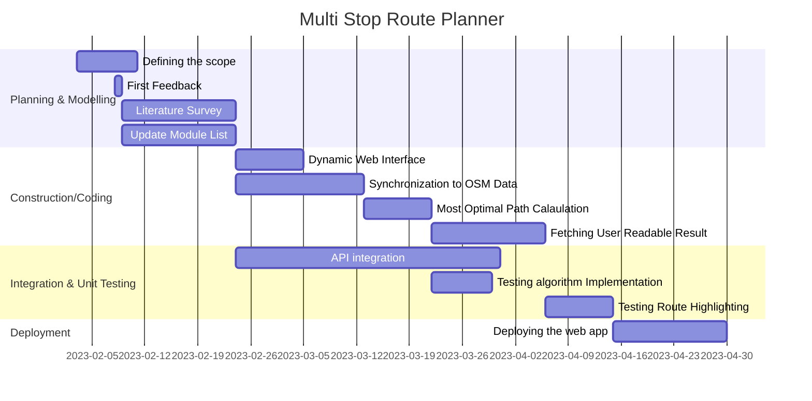
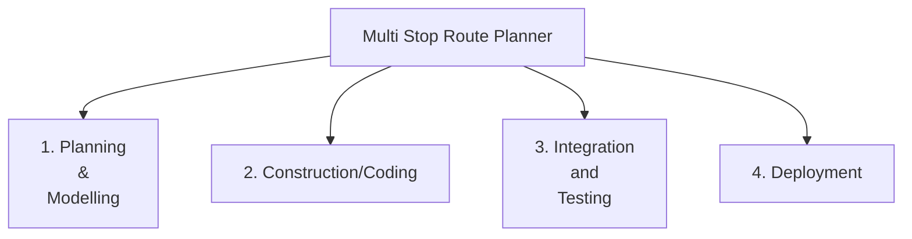
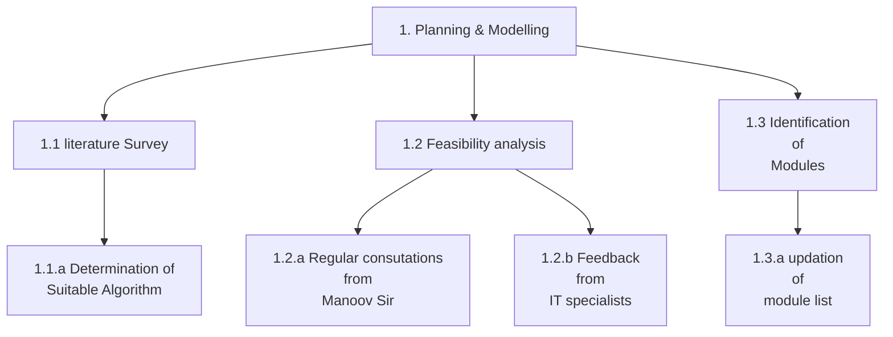
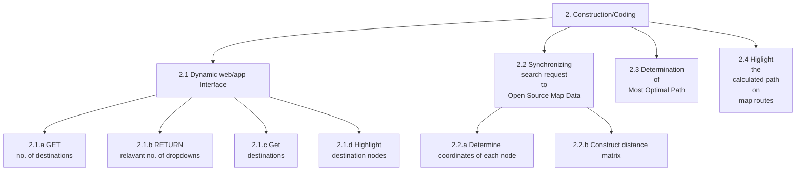
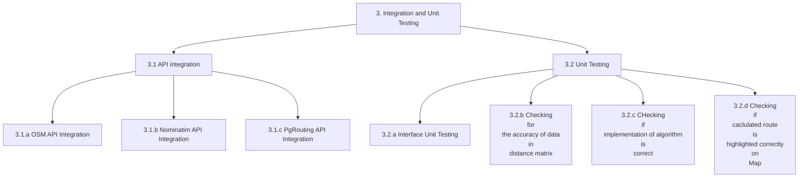
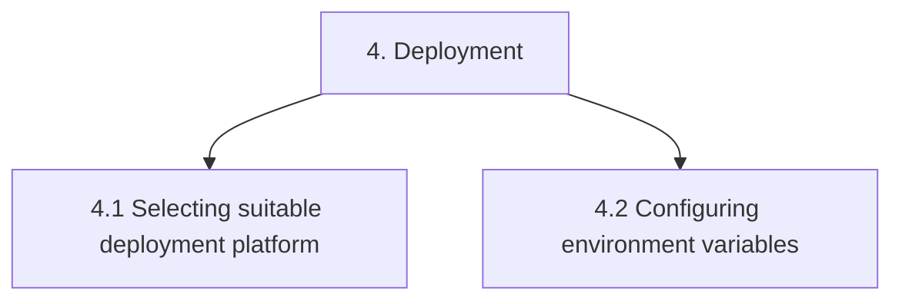
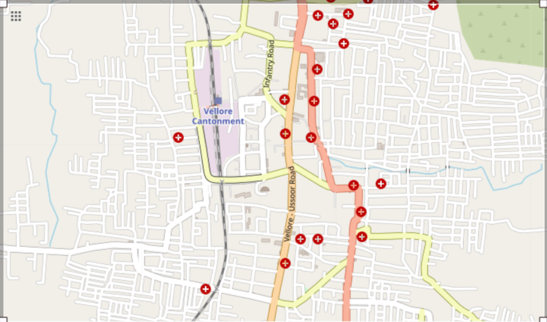

# Destiny-Defined_TARP

### Project Title 

Mutli Destination Most Optimal Route Planner

### Objective
We wish to build a web app that would enable tourists who may wish to travel to multiple destinations in a new city to navigate the shortest route without passing the same street twice. This would prove to be really useful in travel planning. 

### Development Model

Iterative Waterfall 
 
In this process model, the development process is divided into several phases such as requirement gathering, design, coding, testing and deployment.
Each phase is executed only when the previous phase is completed, so it is a step by step process without parallelism.
It is suitable for small scale projects with low risks, when quality is preferred over cost and requirements are well-known upfront.
The iterative nature provides for error correction at the end of each phase leading to less errors in the final testing phase.

### Roles and Responsibilities

1. Dynamic Web Interface: Prakhar Goyal (20BCE2211) and Harshit Jaiswal (20BCE2157)
2. Synchronizing search request to open source Map Data: Pranjal Choudhary (20BCE0571) and Anmol Gupta (20BCB0135)
3. Determination of most optimal Path : Vivek Rathore (20BCE0573) and Aditya Singh Rathore (20BCE0730)
4. Highlighting the calculated route on GMaps : Rama Krishna Mohapatro (20BCE0877) and Pallav Jyoti Buragohain (20BCE0866)
5. <i><b>Note:</b> Visit [here](Workflow.md) to checkout the workflow</i>

### FlowChart

### Gantt Chart

### Activity-based Work Breakdown Structure

### Software Requirements

#### 1. Dependencies
 - mermaid-js (for documentation)
 - HTML, Tailwind CSS and Vanilla Javascript (For dynamic web UI)
 - Nominatim API (Allows geocoding and reverse geocoding which in turn allows to both search a coordinate by name as well as find the coordinates of a destination to determine the closest nodes/destinations tot that destination)
 - Leaflet Library (Mobile friendly interactive maps)
 - OpenChargeMap API (allows access to open data registry of EV charging points)
 - OpenStreetMap API (allows us to use OSM database)

#### 2. Databases
 - OpenStreetMap (OSM) - PostgreSQL based

    

 - pgRouting (Represents the city as a weighted graph and helps implement several routing algorithms)
 

#### 3. Development Environment 

Code Editor: VS Code 
MarkDown Editor : Obsidian 
Browser: Chrome(majorly) 
Graphics Editor: Figma, Adobe Photoshop 
FTP Client: FileZilla, CyberDuck 
Version Control: Git 
Module Integration: Github

### Hardware Requirements

Operating System: Windows 8 or later 
Processor: Intel Pentium 4 or later 
Memory: 2GB minimum, 4GB recommended 
Screen Resolution: 1280X1024 or larger 
Internet upstream Bandwidth: 2Mbps or more 
Browser: Chrome/Edge/Firefox

### Literature Survey

|  Title  |  Author  |  Algorithm and dataset  |  Important Findings  |  Limitations  |  References  |
| --- | --- | --- | --- | --- | --- |
| Expert Systems with Applications | Pieter Vansteenwegen (2011) | The proposed solution approach in this paper is based on a Greedy Randomised Adaptive Search Procedure (GRASP). This metaheuristic was first introduced by Feo and Resende (1989); it was successfully applied to the Team OP, without time windows, by Souffriau, Vansteenwegen, Vanden Berghe, and Van Oudheusden (2010). | The TOP/TW is a difficult combinatorial optimisation problem. A good suboptimal solution will suffice. Indeed, a small loss in solution quality is insignificant for the application, considering the inherent shortcomings of quantifying a tourist’s personal interest in a location. For these reasons, the authors propose a metaheuristic as a solution method. | The limitations are Fixed Traffic Condition, Computational Complexity and Incomplete Data | Baeza-Yates, R., & Ribeiro-Neto, R. (1999). Modern information retrieval. AddisonWesley and Dasarathy, B. (1991). Nearest neighbor (NN) norms: NN pattern classification techniques. IEEE Computer Society Press. |
| A Development of Travel Itinerary Planning Application using Traveling Salesman Problem and K-Means Clustering Approach |  Septia Rani, Kartika Nur Kholidah, Sheila Nurul Huda | The development of a travel itinerary planning application using the Traveling Salesman Problem (TSP) and K-Means Clustering approach involves the use of algorithms to generate the most efficient travel route for a given set of destinations. The dataset used in this application would consist of a list of destinations, their respective locations (latitude and longitude), and other relevant information such as opening hours, admission fees, and ratings. | The application allows users to create personalized travel plans based on their preferences and interests. This helps in creating a unique travel experience for each user, and also provides real-time updates on travel routes and destination recommendations based on user feedback. This helps in creating a flexible travel plan that can be adjusted based on user preferences. | The limitations are Computational Complexity, Lack of Flexibility and Inaccurate Recommendations. | Hsu, F. C. and Chen, P. 2000. Interactive genetic algorithms for a travel itinerary planning problem. TSP, 1, 13. and Russell, S. and Norvig, P. 1995. Artificial Intelligence A Modern Approach. Prentice-Hall, Egnlewood Cliffs, 25, 27. |
| An efficient multi-destinations trip planning protocol for intelligent transport system | Hisham Siam and Maram Bani Younes | The technology of Intelligent Transport System (ITS) helped them to introduce protocols that serve drivers during their trips in a real-time fashion. A global optimal path-planning algorithm that uses real-time traffic information. This algorithm uses a hybrid technology of vehicular network and enhanced ITS to analyze the traffic and recommend the best path for drivers. | The metrics depend on the time each vehicle spends driving on the streets. Because of this, they have assumed that drivers do not spend anytime at any destination, then we have also assumed the entire trip starts and ends during the same period of time. | The limitations are insufficient data, computational complexity and traffic conditions. | Collins K, Muntean G-M. A vehicle route management solution enabled by wireless vehicular networks. In: IEEE INFOCOM Workshops;2008; Calgary, BC, Canada:1-6. and Bani Younes M, Boukerche A, Roman-Alonso G. An intelligent path recommendation protocol (ICOD) for VANETs. Comput Netw. 2014;64(8):225-242 |
| Multi-Destination Vehicular Route Planning with Parking and Traffic Constraints | Abeer et al. (2019) | The algorithm uses a clustering phase and a graph search phase. In the clustering phase, the algorithm groups destinations that are close to each other to reduce the search space. In the graph search phase, the algorithm uses a modified version of the A* algorithm to find the optimal path between the clusters while taking into account parking and traffic constraints . The article uses real world traffic data and synthetic parking data | The proposed algorithm was evaluated and compared with Nearest Neighbour algorithm and the Traveling Salesman Problem algorithm. The simulations show that the proposed algorithm outperforms the other algorithms in terms of both route quality and computation time. | The limitations are Limited Parking Availability , Fixed Traffic Conditions , Incomplete Data , Computational Complexity | Hakeem, A., Gehani, N., Ding, X., Curtmola, R., & Borcea, C. (2019, November). Multi-destination vehicular route planning with parking and traffic constraints. In _Proceedings of the 16th EAI International Conference on Mobile and Ubiquitous Systems: Computing, Networking and Services_ (pp. 298-307). |
| Multi-Destinations Round Trip Planner Protocol | Hisham Siam , Maram Bani Younes | This paper presents a real- time multi-destinations round trip planner protocol. The proposed protocol considers the relative locations of the targeted destinations and the traffic characteristics over the road network.  This protocol uses the location of each destination on the downtown area and the predicted and real-time traffic characteristics there. The traffic characteristics of each road segment are provided to our protocol using the GPS satellites. | All of the previous research studies have recommended  the path towards a certain destination. None of them have presented a full path towards multiple destinations. In this a path planning protocol that intends to find the best sequence of visiting set of destinations and recommends the best path between each two successive ones. All candidate paths (sequences) of visiting these destinations are explored. After that, the shortest road distance and the shortest estimated traveling time are computed between each two targeted destinations in that trip. | The limitations are computational complexity, incomplete data of traffic characteristics of road segment and delay in real time traffic distribution data. | Siam, H., & Younes, M. B. (2018, October). Multi-Destinations Round Trip Planner Protocol. In _2018 Fifth International Symposium on Innovation in Information and Communication Technology (ISIICT)_ (pp. 1-5). IEEE. |
| Multimodal Public Transit Trip Planner with Real-Time Transit Data | Nilesh et al.(2013)  | The Algorithms used are Dijkstra's algorithm: to find the shortest path between two points in a graph , A* algorithm: to optimize the search for the shortest path by using a heuristic function that estimates the distance to the goal , Floyd-Warshall algorithm: to find the shortest paths between all pairs of nodes in a weighted graph , K-means clustering algorithm: to group similar transit stations based on their geographic proximity. It uses real-time transit data to provide optimal routes for users. | The proposed system was effective in providing optimal multimodal transit routes to users, taking into account real-time transit data and user preferences and constraints. The system was able to generate routes that were both efficient and convenient, taking into account factors such as travel time, cost, and transfer times. The use of real-time transit data was crucial in ensuring the accuracy of the system's recommendations, as it allowed the system to account for unexpected events such as delays or cancellations. | The limitations include limited coverage of real-time transit data,  limited consideration of user preferences and constraints ,  Difficulty in accounting for user behaviour  and complexity of the system.  | Borole, N., Rout, D., Goel, N., Vedagiri, P., & Mathew, T. V. (2013). Multimodal public transit trip planner with real-time transit data. _Procedia-Social and Behavioral Sciences_, _104_, 775-784.  | 
| A multi-objective time-dependent route planner: a real world application to Milano city| Maurizio Bruglieri, Alberto Colorni, Federico Lia, Alessandro Luè | Such a problem is solved with a map matching algorithm inspired by Quddus et al.The algorithm is based on a Pareto optimization approach and takes into account multiple objectives, such as travel time, distance, and environmental impact. The dataset used in the paper is a real-world dataset of road network and traffic conditions in Milan, Italy.| The algorithm is based on a combination of Dijkstra's algorithm and the Pareto dominance principle, and is able to generate routes that minimize travel time, CO2 emissions, and noise pollution simultaneously. | Limited validation,specific geographic area,Lack of consideration for real-time traffic information,Limited optimization criteria,Limited consideration for user preferences  | --- |
| RouteMe: A Mobile Recommender System for Personalized, Multi-Modal Route Planning | Daniel Herzog Hesham Massoud Wolfgang Wornd| They implemented CCO as a CF algorithm to identify routes recommended by other users in the system.Correlated Cross-Occurrence (CCO) is a CF algorithm based on the open source, scalable machine-learning libraries Apache Mahout and Apache Spark.  Dataset - The paper does not mention any specific dataset used for the experiments.Instead, the authors state that they collected data from real users through a mobile app that implements the proposed algorithm. | personalized, multi-modal route planning. The system utilizes a hybrid collaborative filtering approach, combining both user-based and item-based collaborative filtering, to recommend personalized routes to users. | Limited coverage,Data accuracy,User preferences,Computational complexity etc  | --- | 
| Designing a route planner to facilitate and promote cycling in Metro Vancouver,Canada | Jason G. Su,Meghan Winters,Melissa Nunes,Michael Brauer | Optimal route selection algorithm.the route planner required an efficient route selection algorithm. One of the oldest and most widely used approaches in network optimization is shortest path analysis (SPA),(Dijkstra;Dantzig;Floyd). The dataset used in the study included road network data, elevation data, and transit schedules | important finding of this paper is that the cycling route planner developed for Metro Vancouver was able to successfully incorporate variables that influence cycling behavior and preferences. | The study did not evaluate the impact of the route planner on increasing cycling rates in the city,The planner is only applicable to Metro Vancouver and may not be easily transferable to other cities with different topographies,infrastructures, and cycling cultures  | --- |

### Methodologies

1. Paper title : A multi-objective time-dependent route planner: a real world application to Milano city.
    
     The paper presents a methodological approach to develop a multi-objective, time-dependent route planner for urban areas, with a real-world application to Milan city. The methodology includes the following steps:
     Data collection: The first step is to collect data from various sources, including maps, traffic data, and public transportation schedules.Network representation: The city road network is represented as a graph, with nodes representing intersections and edges representing road segments.Traffic simulation: A traffic simulation model is developed to estimate travel times on road segments, considering different factors such as road geometry, speed limits, and traffic congestion.Public transportation simulation: A simulation model for public transportation is developed to estimate travel times and frequencies of buses and trains.Multi-objective optimization: The route planner is designed as a multi-objective optimization problem, with objectives such as minimizing travel time, minimizing transfer times, and maximizing reliability. The optimization problem is solved using a genetic algorithm.Implementation: The route planner is implemented as a web-based application, allowing users to input their origin and destination, as well as other preferences, such as travel time and mode of transportation.Evaluation: The performance of the route planner is evaluated using real-world data, comparing it to other route planning tools and to actual travel times recorded by GPS devices.Overall, the methodology presented in the paper provides a comprehensive approach to developing a multi-objective, time-dependent route planner for urban areas, with potential applications in other cities.
2. Paper title : RouteMe: A Mobile Recommender System for Personalized, Multi-Modal Route Planning.    
     1.Data Collection: The authors collected data from multiple sources such as OpenStreetMap, Google Maps, and public transport schedules to create a multimodal transportation network for the city of Munich, Germany.2.User Profiling: The authors collected user preferences and information through a survey and used this information to create user profiles. These profiles included information such as preferred transportation modes, willingness to walk, and preferred departure times.3. Recommendation Algorithm: The authors developed a recommendation algorithm that uses user profiles, real-time traffic data, and event data to generate ersonalized, multi-modal route recommendations. The algorithm takes into account factors such as travel time, cost, and user preferences to generate recommendations.4.Evaluation: The authors evaluated the performance of the recommendation algorithm through user studies and compared it to other existing route planning apps.5.Implementation: The authors implemented the RouteMe system as a mobile application and made it publicly available for users to download and use.Overall, the methodology used in this paper involved data collection, user profiling, algorithm development, evaluation, and implementation of the RouteMe system.
    
     

3. Paper title : Designing a route planner to facilitate and promote cycling in Metro Vancouver,Canada
    
     The methodology of the paper "Designing a route planner to facilitate and promote cycling in Metro Vancouver, Canada" involves the development of a cycling route planner that incorporates various factors that influence the choice of cycling as a mode of transport. The planner is designed using a geographical information system-based approach and includes variables such as distance, elevation gain, safety, route features, air pollution, and links to transit. The planner also allows for the incorporation of multiple user preferences in route selection, uses topology to minimize data storage redundancy, and relies on node/vertex index tables to increase the efficiency of the route selection process. Overall, the methodology involves the integration of various technological and user-centered approaches to develop a cycling route planner that is effective and user-friendly.

### References

##### Scholarly References
- Huang, Y., Ying, J. J. C., Yu, P. S., & Tseng, V. S. (2020). Dynamic graph mining for multi-weight multi-destination route planning with deadlines constraints. ACM Transactions on Knowledge Discovery from Data (TKDD), 15(1), 1-32. [[doi link]](https://doi.org/10.1145/3412363)
- Chowdhury, S., & Giacaman, N. (2015). En-route planning of multi-destination public-transport trips using smartphones. Journal of Public Transportation, 18(4), 31-45. [[doi link]](https://doi.org/10.5038/2375-0901.18.4.3)
- Hakeem, A., Gehani, N., Ding, X., Curtmola, R., & Borcea, C. (2019, November). Multi-destination vehicular route planning with parking and traffic constraints. In Proceedings of the 16th EAI International Conference on Mobile and Ubiquitous Systems: Computing, Networking and Services (pp. 298-307) [[doi link]](https://doi.org/10.1145/3360774.3360824)
- Nanayakkara, S. C., Srinivasan, D., Lup, L. W., German, X., Taylor, E., & Ong, S. H. (2007, September). Genetic algorithm based route planner for large urban street networks. In 2007 IEEE Congress on Evolutionary Computation (pp. 4469-4474). IEEE [[doi link]](https://doi.org/10.1109/CEC.2007.4425056)
- Edelkamp, S., Jabbar, S., & Willhalm, T. (2005). Geometric travel planning. IEEE Transactions on Intelligent Transportation Systems, 6(1), 5-16. [[doi link]](https://doi.org/10.1109/TITS.2004.838182)

##### Web References
- https://pgrouting.org/
- https://www.openstreetmap.org/
- https://developers.google.com/maps/documentation/javascript/distancematrix
- https://www.w3schools.com/graphics/google_maps_basic.asp
- https://www.upperinc.com/blog/what-is-multi-stop-route-planning/
- https://pretalx.com/sotm-africa-2021/talk/7YHERU/
- https://memgraph.com/blog/how-to-build-a-route-planning-application-with-breadth-first-search-and-dijkstras-algorithm
- https://towardsdatascience.com/driving-distance-between-two-or-more-places-in-python-89779d691def

##### Learning Resources
- [Markdown cheatsheet for preparing Readme.md](https://github.com/christianlempa/cheat-sheets/blob/main/misc/markdown.md)
- [How to use an API tutorial](https://www.youtube.com/watch?v=WXsD0ZgxjRw)
- [pgRouting Workshop - Self Study](http://workshop.pgrouting.org/2.8/en/index.html)
- [Using OpenStreetMAP data with pgRouting](https://medium.com/@frederic.rodrigo/imposm2pgrouting-route-planning-on-openstreetmap-road-network-with-the-benefit-of-updates-1e70f280ac5e)
- [Loading data from OpenStreet Map API](https://towardsdatascience.com/loading-data-from-openstreetmap-with-python-and-the-overpass-api-513882a27fd0)
- [Visulaization](https://towardsdatascience.com/find-and-plot-your-optimal-path-using-plotly-and-networkx-in-python-17e75387b873)

