# Destiny-Defined_TARP

### Project Title 

Mutli Destination Most Optimal Route Planner

### Development Model

Iterative Waterfall

### Roles and Responsibilities

Dynamic Web Interface: Prakhar Goyal (20BCE2211) and Harshit Jaiswal (20BCE2157)
Synchronizing search request to open source Map Data: Pranjal Choudhary (20BCE0571) and Anmol Gupta (20BCB0135)
Determination of most optimal Path : Vivek Rathore (20BCE0573) and Aditya Singh Rathore (20BCE0730)
Highlighting the calculated route on GMaps : Rama Krishna Mohapatro (20BCE0877) and Pallav Jyoti Buragohain (20BCE0866)

### Software Requirements

- Leaflet Library
- OpenChargeMap API
- OpenStreetMap API

### FlowChart

### Gantt Chart

### Work Breakdown Structure

```mermaid
graph TD
id1[Multi Stop Route Planner] --> id2[Planning<br>&<br>Modelling]
id1 --> id3[Construction/Coding]
id1 --> id4[Integration<br>and<br>Testing]
id1 --> id5[Deployment]
id2 --> id2a[literature Survey]
id2a --> id2a1[Determination of<br>Suitable Algorithm]
id2 --> id2b[Feasibility analysis]
id2b --> id2b1[Regular consutations<br>from<br>Manoov Sir]
id2b --> id2b2[Feedback<br>from<br>IT specialists]
id2 --> id2c[Identification<br>of<br>Modules]
id2c --> id2c1[updation<br>of<br>module list]
id3 --> id3a[Dynamic web/app Interface]
id3a --> id3a1[GET<br>no. of destinations]
id3a --> id3a2[RETURN<br>relavant no. of dropdowns]
id3a --> id3a3[Get<br>destinations]
id3a --> id3a4[Highlight<br>destination nodes]
id3 --> id3b[Synchronizing<br>search request<br>to<br>Open Source Map Data]
id3b --> id3b1[Determine coordinates of each node]
id3b --> id3b2[Construct distance matrix]
id3 --> id3c[Determination<br>of<br>Most Optimal Path]
id3 --> id3d[Higlight<br>the<br>calculated path<br>on<br>map routes]
id4 --> id4a[API integration]
id4a --> id4a1[OSM API Integration]
id4a --> id4a2[Nominatim API Integration]
id4a --> id4a3[PgRouting API Integration]
id4 --> id4b[Unit Testing]
id4b --> id4b1[Interface Unit Testing]
id4b --> id4b2[Checking<br>for<br>the accuracy of data<br>in<br>distance matrix]
id4b --> id4b3[CHecking<br>if<br>implementation of algorithm<br>is<br>correct]
id4b --> id4b4[Checking<br>if<br>caclulated route<br>is<br>highlighted correctly<br>on<br>Map]
id5 --> id5a[Selecting suitable deployment platform]
id5 -->id5b[Configuring environment variables]


```

### Dependencies

- mermaid-js (for documentation)
- Nominatim API (Allows geocoding and reverse geocoding which in turn allows to both search a coordinate by name as well as find the coordinates of a destination to determine the closest nodes/destinations tot that destination)

### Resources

##### 1. Reference and Learning
- [Markdown cheatsheet for preparing Readme.md](https://github.com/christianlempa/cheat-sheets/blob/main/misc/markdown.md)
- [How to use an API tutorial](https://www.youtube.com/watch?v=WXsD0ZgxjRw)

##### 2. Databases
- OpenStreetMap (OSM) - PostgreSQL based

- pgRouting (Represents the city as a weighted graph and helps implement several routing algorithms)

