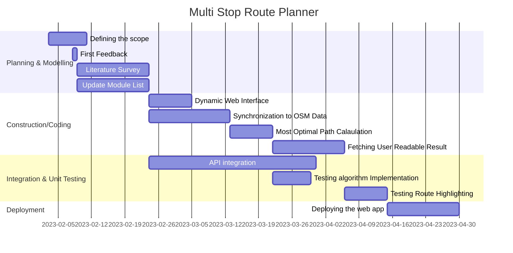
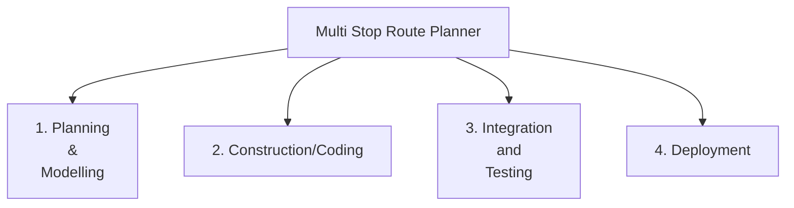
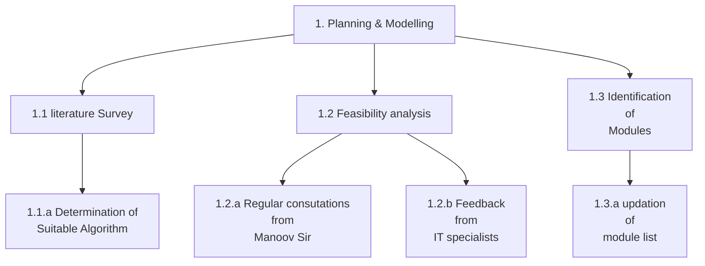
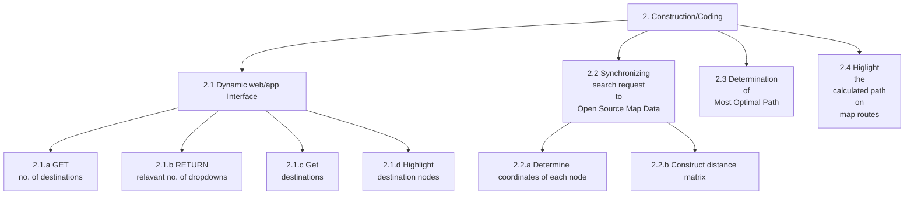
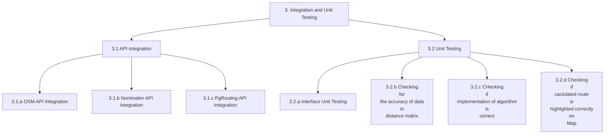
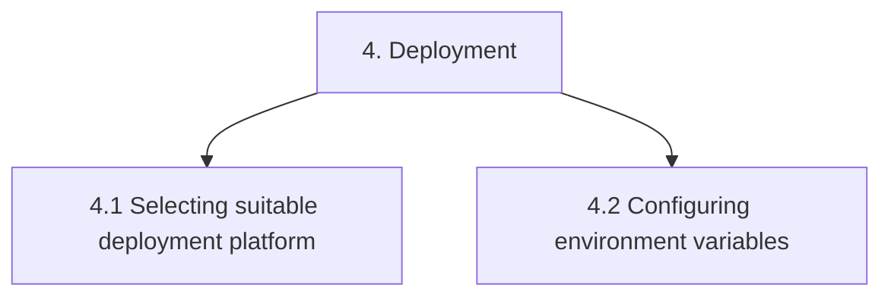

# Destiny-Defined_TARP

### Project Title 

Travel Itinerary Planner

### Objective
We wish to build a web app that would enable tourists who may wish to travel to multiple destinations in a new city to navigate the shortest route without passing the same street twice. This would prove to be really useful in travel planning. 

### Development Model

Iterative Waterfall<br>
<br>
In this process model, the development process is divided into several phases such as requirement gathering, design, coding, testing and deployment.
Each phase is executed only when the previous phase is completed, so it is a step by step process without parallelism.
It is suitable for small scale projects with low risks, when quality is preferred over cost and requirements are well-known upfront.
The iterative nature provides for error correction at the end of each phase leading to less errors in the final testing phase.

### Roles and Responsibilities

1. Dynamic Web Interface: Prakhar Goyal (20BCE2211) and Harshit Jaiswal (20BCE2157)
2. Synchronizing search request to open source Map Data: Pranjal Choudhary (20BCE0571) and Anmol Gupta (20BCB0135)
3. Determination of most optimal Path : Vivek Rathore (20BCE0573) and Aditya Singh Rathore (20BCE0730)
4. Highlighting the calculated route on GMaps : Rama Krishna Mohapatro (20BCE0877) and Pallav Jyoti Buragohain (20BCE0866)
5. <i><b>Note:</b> Visit [here](Workflow.md) to checkout the workflow</i>


### FlowChart


### Gantt Chart



### Activity-based Work Breakdown Structure










### Software Requirements

#### 1. Dependencies
 - mermaid-js (for documentation)
 - HTML, Tailwind CSS and Vanilla Javascript (For dynamic web UI)
 - Nominatim API (Allows geocoding and reverse geocoding which in turn allows to both search a coordinate by name as well as find the coordinates of a destination to determine the closest nodes/destinations tot that destination)
 - Leaflet Library (Mobile friendly interactive maps)
 - OpenChargeMap API (allows access to open data registry of EV charging points)
 - OpenStreetMap API (allows us to use OSM database)

#### 2. Databases
 - OpenStreetMap (OSM) - PostgreSQL based

    

 - pgRouting (Represents the city as a weighted graph and helps implement several routing algorithms)
 

#### 3. Development Environment 

Code Editor: VS Code<br>
MarkDown Editor : Obsidian<br>
Browser: Chrome(majorly)<br>
Graphics Editor: Figma, Adobe Photoshop<br>
FTP Client: FileZilla, CyberDuck<br>
Version Control: Git<br>
Module Integration: Github

### Hardware Requirements

Operating System: Windows 8 or later<br>
Processor: Intel Pentium 4 or later<br>
Memory: 2GB minimum, 4GB recommended<br>
Screen Resolution: 1280X1024 or larger<br>
Internet upstream Bandwidth: 2Mbps or more<br>
Browser: Chrome/Edge/Firefox


###   Literature Survey

|  Title  |  Author  |  Algorithm and dataset  |  Important Findings  |  Limitations  |  References  |
| --- | --- | --- | --- | --- | --- |
| Expert Systems with Applications | Pieter Vansteenwegen (2011) | The proposed solution approach in this paper is based on a Greedy Randomised Adaptive Search Procedure (GRASP). This metaheuristic was first introduced by Feo and Resende (1989); it was successfully applied to the Team OP, without time windows, by Souffriau, Vansteenwegen, Vanden Berghe, and Van Oudheusden (2010). | The TOP/TW is a difficult combinatorial optimisation problem. A good suboptimal solution will suffice. Indeed, a small loss in solution quality is insignificant for the application, considering the inherent shortcomings of quantifying a tourist’s personal interest in a location. For these reasons, the authors propose a metaheuristic as a solution method. | The limitations are Fixed Traffic Condition, Computational Complexity and Incomplete Data | Baeza-Yates, R., & Ribeiro-Neto, R. (1999). Modern information retrieval. AddisonWesley and Dasarathy, B. (1991). Nearest neighbor (NN) norms: NN pattern classification techniques. IEEE Computer Society Press. |
| A Development of Travel Itinerary Planning Application using Traveling Salesman Problem and K-Means Clustering Approach |  Septia Rani, Kartika Nur Kholidah, Sheila Nurul Huda | The development of a travel itinerary planning application using the Traveling Salesman Problem (TSP) and K-Means Clustering approach involves the use of algorithms to generate the most efficient travel route for a given set of destinations. The dataset used in this application would consist of a list of destinations, their respective locations (latitude and longitude), and other relevant information such as opening hours, admission fees, and ratings. | The application allows users to create personalized travel plans based on their preferences and interests. This helps in creating a unique travel experience for each user, and also provides real-time updates on travel routes and destination recommendations based on user feedback. This helps in creating a flexible travel plan that can be adjusted based on user preferences. | The limitations are Computational Complexity, Lack of Flexibility and Inaccurate Recommendations. | Hsu, F. C. and Chen, P. 2000. Interactive genetic algorithms for a travel itinerary planning problem. TSP, 1, 13. and Russell, S. and Norvig, P. 1995. Artificial Intelligence A Modern Approach. Prentice-Hall, Egnlewood Cliffs, 25, 27. |
| An efficient multi-destinations trip planning protocol for intelligent transport system | Hisham Siam and Maram Bani Younes | The technology of Intelligent Transport System (ITS) helped them to introduce protocols that serve drivers during their trips in a real-time fashion. A global optimal path-planning algorithm that uses real-time traffic information. This algorithm uses a hybrid technology of vehicular network and enhanced ITS to analyze the traffic and recommend the best path for drivers. | The metrics depend on the time each vehicle spends driving on the streets. Because of this, they have assumed that drivers do not spend anytime at any destination, then we have also assumed the entire trip starts and ends during the same period of time. | The limitations are insufficient data, computational complexity and traffic conditions. | Collins K, Muntean G-M. A vehicle route management solution enabled by wireless vehicular networks. In: IEEE INFOCOM Workshops;2008; Calgary, BC, Canada:1-6. and Bani Younes M, Boukerche A, Roman-Alonso G. An intelligent path recommendation protocol (ICOD) for VANETs. Comput Netw. 2014;64(8):225-242 |
| Multi-Destination Vehicular Route Planning with Parking and Traffic Constraints | Abeer et al. (2019) | The algorithm uses a clustering phase and a graph search phase. In the clustering phase, the algorithm groups destinations that are close to each other to reduce the search space. In the graph search phase, the algorithm uses a modified version of the A* algorithm to find the optimal path between the clusters while taking into account parking and traffic constraints . The article uses real world traffic data and synthetic parking data | The proposed algorithm was evaluated and compared with Nearest Neighbour algorithm and the Traveling Salesman Problem algorithm. The simulations show that the proposed algorithm outperforms the other algorithms in terms of both route quality and computation time. | The limitations are Limited Parking Availability , Fixed Traffic Conditions , Incomplete Data , Computational Complexity | Hakeem, A., Gehani, N., Ding, X., Curtmola, R., & Borcea, C. (2019, November). Multi-destination vehicular route planning with parking and traffic constraints. In _Proceedings of the 16th EAI International Conference on Mobile and Ubiquitous Systems: Computing, Networking and Services_ (pp. 298-307). |
| Multi-Destinations Round Trip Planner Protocol | Hisham Siam , Maram Bani Younes | This paper presents a real- time multi-destinations round trip planner protocol. The proposed protocol considers the relative locations of the targeted destinations and the traffic characteristics over the road network.  This protocol uses the location of each destination on the downtown area and the predicted and real-time traffic characteristics there. The traffic characteristics of each road segment are provided to our protocol using the GPS satellites. | All of the previous research studies have recommended  the path towards a certain destination. None of them have presented a full path towards multiple destinations. In this a path planning protocol that intends to find the best sequence of visiting set of destinations and recommends the best path between each two successive ones. All candidate paths (sequences) of visiting these destinations are explored. After that, the shortest road distance and the shortest estimated traveling time are computed between each two targeted destinations in that trip. | The limitations are computational complexity, incomplete data of traffic characteristics of road segment and delay in real time traffic distribution data. | Siam, H., & Younes, M. B. (2018, October). Multi-Destinations Round Trip Planner Protocol. In _2018 Fifth International Symposium on Innovation in Information and Communication Technology (ISIICT)_ (pp. 1-5). IEEE. |
| Multimodal Public Transit Trip Planner with Real-Time Transit Data | Nilesh et al.(2013)  | The Algorithms used are Dijkstra's algorithm: to find the shortest path between two points in a graph , A* algorithm: to optimize the search for the shortest path by using a heuristic function that estimates the distance to the goal , Floyd-Warshall algorithm: to find the shortest paths between all pairs of nodes in a weighted graph , K-means clustering algorithm: to group similar transit stations based on their geographic proximity. It uses real-time transit data to provide optimal routes for users. | The proposed system was effective in providing optimal multimodal transit routes to users, taking into account real-time transit data and user preferences and constraints. The system was able to generate routes that were both efficient and convenient, taking into account factors such as travel time, cost, and transfer times. The use of real-time transit data was crucial in ensuring the accuracy of the system's recommendations, as it allowed the system to account for unexpected events such as delays or cancellations. | The limitations include limited coverage of real-time transit data,  limited consideration of user preferences and constraints ,  Difficulty in accounting for user behaviour  and complexity of the system.  | Borole, N., Rout, D., Goel, N., Vedagiri, P., & Mathew, T. V. (2013). Multimodal public transit trip planner with real-time transit data. _Procedia-Social and Behavioral Sciences_, _104_, 775-784.  | 
| A multi-objective time-dependent route planner: a real world application to Milano city| Maurizio Bruglieri, Alberto Colorni, Federico Lia, Alessandro Luè | Such a problem is solved with a map matching algorithm inspired by Quddus et al.The algorithm is based on a Pareto optimization approach and takes into account multiple objectives, such as travel time, distance, and environmental impact.<br>The dataset used in the paper is a real-world dataset of road network and traffic conditions in Milan, Italy.| The algorithm is based on a combination of Dijkstra's algorithm and the Pareto dominance principle, and is able to generate routes that minimize travel time, CO2 emissions, and noise pollution simultaneously. | Limited validation,specific geographic area,Lack of consideration for real-time traffic information,Limited optimization criteria,Limited consideration for user preferences  | Bruglieri, M., Colorni, A., Lia, F., & Luè, A. (2014). A multi-objective time-dependent route planner: A real world application to Milano city. Transportation Research Procedia, 3, 460-469. |
| RouteMe: A Mobile Recommender System for Personalized, Multi-Modal Route Planning | Daniel Herzog Hesham Massoud Wolfgang Wornd| They implemented CCO as a CF algorithm to identify routes recommended by other users in the system.Correlated Cross-Occurrence (CCO) is a CF algorithm based on the open source, scalable machine-learning libraries Apache Mahout and Apache Spark.<br> Dataset - The paper does not mention any specific dataset used for the experiments.Instead, the authors state that they collected data from real users through a mobile app that implements the proposed algorithm. | personalized, multi-modal route planning. The system utilizes a hybrid collaborative filtering approach, combining both user-based and item-based collaborative filtering, to recommend personalized routes to users. | Limited coverage,Data accuracy,User preferences,Computational complexity etc  | Herzog, D., Massoud, H., & Wörndl, W. (2017, July). Routeme: A mobile recommender system for personalized, multi-modal route planning. In Proceedings of the 25th Conference on User Modeling, Adaptation and Personalization (pp. 67-75). | 
| Designing a route planner to facilitate and promote cycling in Metro Vancouver,Canada | Jason G. Su,Meghan Winters,Melissa Nunes,Michael Brauer | Optimal route selection algorithm.the route planner required an efficient route selection algorithm. One of the oldest and most widely used approaches in network optimization is shortest path analysis (SPA),(Dijkstra;Dantzig;Floyd).<br>The dataset used in the study included road network data, elevation data, and transit schedules | important finding of this paper is that the cycling route planner developed for Metro Vancouver was able to successfully incorporate variables that influence cycling behavior and preferences. | The study did not evaluate the impact of the route planner on increasing cycling rates in the city,The planner is only applicable to Metro Vancouver and may not be easily transferable to other cities with different topographies,infrastructures, and cycling cultures  | Su, J. G., Winters, M., Nunes, M., & Brauer, M. (2010). Designing a route planner to facilitate and promote cycling in Metro Vancouver, Canada. Transportation research part A: policy and practice, 44(7), 495-505. |
| Personalized Route Planning in Road Networks | Stefan Funke and Sabine Storandt |  Author develop k-PC(k-pruning algo) that are used to reduce sets in an optimality preserving way <br>Dataset we can thereby decrease the space consumption of the auxiliary data thai is  road network dataset from OpenStreetMap (OSM). | The use of personalized route planning can lead to more efficient and satisfying travel experiences for users, as it takes into account their individual preferences and constraints. | The proposed method does not consider real-time traffic conditions, which may affect the actual travel time and route selection. | Funke, S., & Storandt, S. (2015, November). Personalized route planning in road networks. In Proceedings of the 23rd SIGSPATIAL International Conference on Advances in Geographic Information Systems (pp. 1-10). |
| Artificial Intelligence Aided Recommendation Based Mobile Trip Planner For Eskisehir City | Ahmet Aydin, Sedat Telceken | Algo:Optimal Route Planner Algo <br> Dataset Google Maps’ geocoding services convert user entries into latitude and longitude coordinates in sql | Proposed system uses artificial intelligence algorithms such as A* and Ant Colony Optimization to calculate the best route for the traveler based on their current GPS location and preferences. The system also offers recommendations to the traveler and allows them to re-plan their route interactively. | The system only considers the user's current location and preferences to plan the trip, but it does not take into account other external factors such as weather conditions, traffic, and events happening in the city. | Aydin, A., & Telceken, S. (2015, June). Artificial intelligence aided recommendation based mobile trip planner for Eskisehir city. In 2015 IEEE 10th Conference on Industrial Electronics and Applications (ICIEA) (pp. 1650-1654). IEEE. |
| Participatory Route Planning | David Wilkie, Cenk Baykal, Ming C. Lin | The A* algorithm from to compute an optimal route with respect to the cost metric between start node s and goal node g at time t0.<br> Live traffic data can be collected by loop-detectors, cameras, toll port data, and cell phone localization | The paper presents a suitable approach for realistic, city-scale scenarios, a prototype system to demonstrate feasibility, and experiments using a state-of-the-art microscopic traffic simulator | The approach's implementation requires significant technological infrastructure and development, which may be costly and difficult to deploy on a large scale. | Wilkie, D., Baykal, C., & Lin, M. C. (2014, November). Participatory route planning. In Proceedings of the 22nd ACM SIGSPATIAL International Conference on Advances in Geographic Information Systems (pp. 213-222). |
|Route recommendation system to support multiple destinations and multiple routes to minimise road congestion |Chayanon Sub-r-pa, Goutam Chakraborty, Bhabani P. Sinha|The algorithm selects n-best routes and assigns a car to one of them based on calculated probabilities. It calculates trial routes using Yen's algorithm and distributes cars based on probability values. Finally, it generates a random number to choose a route. For the road network, a part of the map affected by tsunami after the great Earthquake in North Japan on 11 March 2011 is used. |The proposed MDMR road navigation algorithm can find multiple near-optimal routes to target destinations, eliminate routes with multiple destination points, and distribute vehicles to prevent traffic congestion. The simulations results using real map data from Miyako, Japan, confirm that distributing traffic along multiple routes can significantly increase the number of vehicles arrived at safe destinations and reduce evacuation time.|The assumption of fixed update intervals and virtual link cost as zero are limitations, and the future work will incorporate dynamic route update intervals and modifications to accommodate traffic flowing into destinations.| Sub-r-pa, C., Chakraborty, G., & Sinha, B. P. (2017). Route recommendation system to support multiple destinations and multiple routes to minimise road congestion. International Journal of Communication Networks and Distributed Systems, 19(4), 465-481. |
|Xhare-a-Ride: A Search Optimized Dynamic Ride Sharing System with Approximation Guarantee |Raja Subramaniam Thangaraj, Koyel Mukherjee, Gurulingesh Raravi, Asmita Metrewar, Narendra Annamaneni and Koushik Chattopadhyay |This research extracted 350,000 taxi journeys from publicly available New York City taxi travel data on a random day. They explain how they created ride sharing data from the dataset's taxi travels. All NY taxi journeys are simulated as ride requests for XAR evaluation. If numerous rides match a request, the algorithm chooses the one with the shortest walking distance. If no matching rides are located, a 4-person taxi is constructed.|Experimental evaluations show that XAR outperforms the state-of-the-art system T-Share in the ride search operation, making it a highly scalable and search-optimized system. This is crucial for integrating with MMTP, which has a high look-to-book ratio. XAR also provides an environment-friendly transport option when combined with public transport, resulting in fewer vehicles on the road.|Taxi is fastest, however it is not eco-friendly and worsens traffic. Public transportation emits less but performs poorly. Ride sharing reduces car use by 64% with only a 30% increase in journey time, balancing quality and eco-friendliness. Ride sharing reduces walking time by 56%, travel time by 30%, and cars needed by approximately 50%.| Thangaraj, R. S., Mukherjee, K., Raravi, G., Metrewar, A., Annamaneni, N., & Chattopadhyay, K. (2017, April). Xhare-a-ride: A search optimized dynamic ride sharing system with approximation guarantee. In 2017 IEEE 33rd International Conference on Data Engineering (ICDE) (pp. 1117-1128). IEEE. |
|Parallel Hyper-Heuristic Algorithm for Multi-Objective Route Planning in a Smart City |Yuan Yao, Zhe Peng, Bin Xiao|The research provides a multi-objective hyper-heuristic (MOHH) framework for smart city walking route planning. The system comprises low-level heuristics for route generation and a reinforcement learning mechanism for picking excellent heuristics to speed up search. In a general-purpose graphics processing unit, RL-MOHH and RL-PMOHH are implemented. This study collected a lot of New York City cross-domain urban data. Urban map, housing rent and density, population, police stations, POIs, crime records, and taxi trajectories were added.|The application offers three route options to the user: the shortest route, the safest route, and a trade-off route based on the user's preference. By default, the trade-off route is determined by a weight vector of 0.4 for distance and 0.6 for safety, but the user can adjust the vector before planning. As the risk of crime increases later in the day, the application can update the safety index of the map and help users avoid high-risk roads by suggesting alternate routes.|The paper notes that the MOHH/PMOHH frameworks still require a significant amount of time to train the utilities of the low-level heuristics. They plan to implement a more efficient online learning algorithm in future work to improve the continuous learning ability of MOHH/PMOHH.| Yao, Y., Peng, Z., & Xiao, B. (2018). Parallel hyper-heuristic algorithm for multi-objective route planning in a smart city. IEEE Transactions on Vehicular Technology, 67(11), 10307-10318. |
| Route planning for blind pedestrians using OpenStreetMap | Achituv Cohen and Sagi Dalyot |The workflow to create a weighted network graph was generated by utilizing ESRI’s ArcGIS ModelBuilder and Python scripts .Similar to the existing route optimization research for disabled people, the Dijkstra algorithm was used. OSM map data are converted into ArcGIS Feature Class (FC) objects. Features intended for pedestrians walking having the value key “highway” form the GraphWays .Road features that must be avoided by blind pedestrians are stored in a different FC, used to calculate added costs and restriction intersections, and are presented as restriction network lines on the network graph. some streets on the OSM map, which are navigational, are displayed as polygons. To amend the polygon elements to linear ones that are later added to the network, we developed a skeleton algorithm using a Thiessen polygon structure, and geometric and topologic rules. | This study presented a methodology that uses OSM data, as well as designing a tailored set of criteria, for generating optimal walking routes for blind pedestrians. Focus is placed on generating routes that are safe and easy to navigate. Qualitative evaluations showed how  developed system and algorithm tend to select a safer and easier route to navigate, preferring more accessible paths while avoiding dangerous locations.| OSM has some shortcomings, mainly in terms of data quality ( accuracy and topological errors) and completeness. | Cohen, A., & Dalyot, S. (2021). Route planning for blind pedestrians using OpenStreetMap. Environment and Planning B: Urban Analytics and City Science, 48(6), 1511-1526. |
| Handling OpenStreetMap georeferenced data for route planning | Soraia Fel´ıcioa, Joana Horaa, Marta Campos Ferreiraa, Diogo Abrantesb, Paulo Dias Costab, Camila Dangeloa, Jorge Silvad, Teresa Galvao |The algorithm used here is the A-star algorithm to determine the route, which applies a best-first search to find the optimal path from the source vertex to the target. The formulation is made in terms of weighted graphs, considering a specified cost for each edge. This algorithm keeps a tree of paths from the source vertex, which is extended one edge at a time until its termination criterion is satisfied. In each iteration, the A-star algorithm chooses which path to extend. A-star ends the iterative process when the path it chooses to extend is a path from the source vertex to the target or when there are no paths eligible to be extended. | This study makes a contribution by improving the OSM data model by including a multi-criteria dimension for route planning, as well as by supporting the process of dealing with geographical data and routing algorithms.| Effectiveness of the A* algorithm are heavily dependent on the quality of the heuristic function used to estimate the distance between the current node and the goal node. If the heuristic function is not well-designed, the algorithm may not find the optimal path, or it may take longer to converge. | Felício, S., Hora, J., Ferreira, M. C., Abrantes, D., Costa, P. D., Dangelo, C., ... & Galvão, T. (2022). Handling OpenStreetMap georeferenced data for route planning. Transportation Research Procedia, 62, 189-196. |
| Real-Time Routing with OpenStreetMap data | Dennis Luxen, Christian Vetter | First, the geometry is generalized according to the zoom level using a heuristic variant of the classic Douglas-Peucker algorithm that can be implemented to run in O(n log n) time . Second, a string of longitude and latitude coordinate pairs is highly compressible. We implement the Google Maps Encoded Polyline Algorithm Format which is simple and offers great compression rate. | They show how to use OSM data with both a server-based approach and a handheld device.These programmes offer precise and real-time shortest path computation on networks the size of continents with millions of street segments. In-depth real-time capabilities like draggable routes and round-trip planning are also shown. | The greatest limitation of handheld devices comes from a limited I/O bandwidth to the flash memory.| Luxen, D., & Vetter, C. (2011, November). Real-time routing with OpenStreetMap data. In Proceedings of the 19th ACM SIGSPATIAL international conference on advances in geographic information systems (pp. 513-516). |
| A Multimodal Trip Planning System Incorporating the Park-and-Ride Mode and Real-time Traffic/Transit Information | Jing-Quan Li, Kun Zhou, Liping Zhang, and Wei-Bin Zhang | Algorithms: Dijkstra's Algorithm , A* Algorithm , Genetic Algorithm  Dataset : OpenStreetMap , GTFS (General Transit Feed Specification) ,Real-time Traffic Data | Locations of parking facilities, including the number of available parking spots and the cost of parking.Real-time transit schedule and delay information, including the location of transit stops and stations. Real-time traffic information, including current road conditions and any disruptions or delays.User preferences, including the origin and destination of the trip and the preferred mode of transportation. | 1)Limited coverage: The system may have limited coverage of the transit and traffic information, which may result in incomplete trip planning information for certain areas. 2) Data accuracy: The accuracy of the real-time traffic/transit information used by the system can be affected by various factors, such as network connectivity issues and technical glitches. Inaccurate data may result in suboptimal trip planning suggestions 3) User behavior: The effectiveness of the system is dependent on user behavior, such as the willingness of users to use the park-and-ride mode and follow the suggested travel routes. If users deviate from the suggested routes, the system's effectiveness may be reduced. 4) Data privacy and security: The system relies on real-time traffic/transit information, which may raise concerns regarding data privacy and security. The collection and use of user data must be transparent and comply with relevant laws and regulations. | Li, J. Q., Zhou, K., Zhang, L., & Zhang, W. B. (2010, October). A multimodal trip planning system incorporating the park-and-ride mode and real-time traffic/transit information. In Proceedings ITS World Congress (Vol. 25, pp. 65-76). |
| A Multi-Modal and Multi-Objective Journey Planner for Integrating Carpooling and Public Transport | Jafar Jamal, Roberto Montemanni, David Huber, Marco Derboni, and Andrea E. Rizzoli | 1)Algorithm for Multi-Modal Route Planning. 2) Support Vector Machines (SVM) 3) Logistic Regression Dataset : 1)Multi-modal network graph for a small city, including bus stops, train stations, and bike rental locations, with schedules and routes for each mode of transportation. 2)Real-time feed for carpooling services, including information about available seats, cancellations, delays, and updated routes. 3) Map data with road network, including speed limits, traffic data, and estimated travel times. 4)Data on user preferences and constraints, such as maximum walking distance, preferred modes of transportation, and departure time constraints. 5)Historical data on traffic patterns, transportation usage, and user behavior, to improve the accuracy of the algorithm and optimize route planning. | The study proposed a multi-modal and multi-objective journey planner that integrates carpooling and public transportation. The planner optimizes for multiple objectives, including travel time, cost, and environmental impact. The proposed approach was tested on real-world data from the Swiss city of Lugano, and the results showed that the planner could reduce the total travel time and cost while also reducing the environmental impact by encouraging carpooling and the use of public transportation. The study concluded that the proposed planner could be a valuable tool for promoting sustainable and efficient transportation. | 1) Data availability: The study heavily relies on data availability from public transport and carpooling services, and the accuracy of the model is dependent on the quality and quantity of the data. 2)Generalizability: The model is developed based on data from a specific city, and it may not be generalizable to other cities with different transportation infrastructures and population densities. 3)User behavior: The model assumes that users will choose the most efficient and cost-effective transportation mode, which may not always be the case. User preferences, attitudes, and habits towards different transportation modes can significantly influence the effectiveness of the model. 4)Technical limitations: The model requires real-time data to be effective, which may not always be feasible due to technical limitations or insufficient resources. 5)Integration with existing systems: The study does not address the challenges of integrating the proposed multi-modal and multi-objective journey planner with existing public transportation and carpooling systems. Integration may require substantial resources and support from relevant stakeholders. | Jamal, J., Montemanni, R., Huber, D., Derboni, M., & Rizzoli, A. E. (2017). A multi-modal and multi-objective journey planner for integrating carpooling and public transport. Journal of Traffic and Logistics Engineering Vol, 5(2), 68-72. |

### Methodologies

##### 1. Paper Title :  A Mobile Application for Multimodal Trip Planning<br><br>
Requirement Analysis: The authors first analyzed the requirements of the mobile application for multimodal trip planning. They studied the existing multimodal transportation systems and identified the shortcomings and challenges that needed to be addressed.<br><br>Design: Based on the requirement analysis, the authors designed the architecture of the mobile application. They decided to use a client-server architecture and selected appropriate technologies for implementation.<br><br>Data Collection: The authors collected data from various sources, including public transportation systems, private transportation providers, and other third-party services. They also collected data on user preferences and feedback through surveys and focus groups.<br>Data Processing: The collected data was processed and integrated into the application's database. The authors developed algorithms for route planning and selection, taking into account various factors such as travel time, cost, and user preferences.<br><br>Implementation: The mobile application was implemented using the selected technologies and tested for functionality and usability. The application was developed for both Android and iOS platforms.<br><br>User Testing: The authors conducted user testing to evaluate the performance and user experience of the application. They collected feedback from users and made necessary improvements to the application.<br>Deployment: The mobile application was deployed on the Google Play Store and the Apple App Store, making it available to users worldwide.<br><br>Evaluation: The authors evaluated the performance of the mobile application based on various metrics such as user ratings, download numbers, and usage statistics. They also compared the application's performance with existing multimodal transportation systems.
<br>
##### 2. Paper Title : A Multi-Modal and Multi-Objective Journey Planner for Integrating Carpooling and Public Transport<br><br>
Problem definition: The first stage involves defining the problem to be addressed by the journey planner. This includes identifying the objectives of the planner, such as reducing travel time, minimizing travel costs, and reducing carbon emissions.<br><br>Data collection: The next stage involves collecting data on the transport network, including information on carpooling services, public transport schedules, and travel time and cost data. This data can be obtained from various sources, such as public transport authorities, carpooling services, and travel surveys.<br><br>Algorithm development: The journey planner algorithm is then developed based on the collected data and the identified objectives. The algorithm is designed to optimize travel routes based on multiple modes of transport, including carpooling and public transport.<br><br>Simulation and testing: The next stage involves simulating the journey planner to test its performance in various scenarios. This includes testing the planner for different travel routes, travel times, and travel modes, as well as different user preferences and objectives.<br><br>Optimization: Based on the simulation results, the journey planner algorithm is optimized to improve its performance in terms of the identified objectives.<br><br>Integration: The final stage involves integrating the journey planner with existing transport services, such as carpooling and public transport providers. This includes developing interfaces between the planner and these services to enable seamless integration.
##### 3. Paper Title : A Multimodal Trip Planning System Incorporating the Park-and-Ride Mode and Real-time Traffic/Transit Information<br><br>
Problem definition: The first stage involves defining the problem to be addressed by the trip planning system. This includes identifying the objectives of the system, such as reducing travel time, minimizing travel costs, and improving user convenience by integrating the park-and-ride mode and real-time traffic/transit information.<br><br>Data collection: The next stage involves collecting data on the transport network, including information on traffic flows, public transport schedules, and park-and-ride facilities. This data can be obtained from various sources, such as transport authorities, park-and-ride operators.<br><br>Algorithm development: The trip planning algorithm is then developed based on the collected data and the identified objectives. The algorithm is designed .to optimize travel routes based on multiple modes of transport, including private vehicles, park-and-ride facilities, and public transport, as well as real-tim,bre traffic/transit information.<br><br>Simulation and testing: The next stage involves simulating the trip planning system to test its performance in various scenarios. This includes testing the system for different travel routes, travel times, and travel modes, as well as different user preferences and objectives.<br><br>O.ptimization: Based on the simulation results, the trip planning algorithm is optimized to improve its performance in terms of the identified objectives.<br><,brbr>Integration: The final stage involves integrating the trip planning system with existing transport services, such as public transport providers and park-and-ride operators. This includes developing interfaces between the system and these services to enable seamless integration.

##### 4. Paper title : A multi-objective time-dependent route planner: a real world application to Milano city.<br><br>
The paper presents a methodological approach to develop a multi-objective, time-dependent route planner for urban areas, with a real-world application to Milan city. The methodology includes the following steps:
Data collection: The first step is to collect data from various sources, including maps, traffic data, and public transportation schedules.Network representation: The city road network is represented as a graph, with nodes representing intersections and edges representing road segments.<br><br>Traffic simulation: A traffic simulation model is developed to estimate travel times on road segments, considering different factors such as road geometry, speed limits, and traffic congestion.<br><br>Public transportation simulation: A simulation model for public transportation is developed to estimate travel times and frequencies of buses and trains.<br><br>Multi-objective optimization: The route planner is designed as a multi-objective optimization problem, with objectives such as minimizing travel time, minimizing transfer times, and maximizing reliability. The optimization problem is solved using a genetic algorithm.Implementation: The route planner is implemented as a web-based application, allowing users to input their origin and destination, as well as other preferences, such as travel time and mode of transportation.<br><br>Evaluation: The performance of the route planner is evaluated using real-world data, comparing it to other route planning tools and to actual travel times recorded by GPS devices.Overall, the methodology presented in the paper provides a comprehensive approach to developing a multi-objective, time-dependent route planner for urban areas, with potential applications in other cities.
     
##### 5. Paper title : RouteMe: A Mobile Recommender System for Personalized, Multi-Modal Route Planning.<br><br>  
Data Collection: The authors collected data from multiple sources such as OpenStreetMap, Google Maps, and public transport schedules to create a multimodal transportation network for the city of Munich, Germany.<br><br>User Profiling: The authors collected user preferences and information through a survey and used this information to create user profiles. These profiles included information such as preferred transportation modes, willingness to walk, and preferred departure times.<br><br>Recommendation Algorithm: The authors developed a recommendation algorithm that uses user profiles, real-time traffic data, and event data to generate ersonalized, multi-modal route recommendations. The algorithm takes into account factors such as travel time, cost, and user preferences to generate recommendations.<br><br>Evaluation: The authors evaluated the performance of the recommendation algorithm through user studies and compared it to other existing route planning apps.<br><br>Implementation: The authors implemented the RouteMe system as a mobile application and made it publicly available for users to download and use.Overall, the methodology used in this paper involved data collection, user profiling, algorithm development, evaluation, and implementation of the RouteMe system.

##### 6. Paper title : Designing a route planner to facilitate and promote cycling in Metro Vancouver,Canada<br><br> 
The methodology of the paper "Designing a route planner to facilitate and promote cycling in Metro Vancouver, Canada" involves the development of a cycling route planner that incorporates various factors that influence the choice of cycling as a mode of transport. The planner is designed using a geographical information system-based approach and includes variables such as distance, elevation gain, safety, route features, air pollution, and links to transit. The planner also allows for the incorporation of multiple user preferences in route selection, uses topology to minimize data storage redundancy, and relies on node/vertex index tables to increase the efficiency of the route selection process. Overall, the methodology involves the integration of various technological and user-centered approaches to develop a cycling route planner that is effective and user-friendly.

### Development

#### Configuring the environment and installing the Dependencies

- Install osmnx

	```python
	conda install osmnx
	conda install gdal=2.4.4
    ```

- Install chart_studio in current environment using

	```python
	pip install chart_studio
	```

#### Code

##### Finding mimimum path cost using Djikstra

```python
def extract_min_vertex_from_queue(distances, queue):
dist_for_queue = {k:distances[k] for k in queue}
return [k for k,v in sorted(dist_for_queue.items(), key= lambda x: x[1])][0]
def dijkstra(M, start_node, end_node):
# initialize parameters
coordinates = M.intersections 
distances = {node: np.inf for node in M._graph.nodes()}
distances[start_node] = 0
queue = M._graph.nodes()
while queue != []:
current_node = extract_min_vertex_from_queue(distances, queue)
queue.remove(current_node)
for neighbour in M.roads[current_node]:
dist = distances[current_node] + calculate_distance(current_node, neighbour, coordinates)
if dist < distances[neighbour]:
distances[neighbour] = dist
return distances[end_node]

```

##### Uniform Cost Algorithm

We are calculating the distance between 2 locations using their coordinates by pythagoras theorom. Inputs are nodeA(int) and nodeB(int). Coordinates can be represented in the form os dictionary with (x,y) coordinates for all nodes in the graph. The function returns euclidean distance between 2 points A and B

```python
def calculate_distance(nodeA, nodeB, coordinates):
    xa,ya = coordinates[nodeA]
    xb,yb = coordinates[nodeB]
    return np.sqrt( (xa-xb)**2 + (ya-yb)**2 )
```

The function selects and return the location on the frontier having the shortest path_cost. The input here is  routes represented by the dictionary associating nodes on the frontier to a composed of a tuple (route, path length). The route is the sequence of traversed locations from start -> to frontier node. The function returns the location on the frontier having the shortest path_cost

```python
def find_nearest_frontier_node(routes):
    path_costs =  {node:routes[node][1] for node in routes}
    return [node for node,path_cost in sorted(path_costs.items(), key= lambda x: x[1])][0]

```

The function below return the shortests path between a start location and a goal location calculated with uniform cost algorithm. The inputs are M which represents a map object (Class Map), start which represents the starting node index (integer) and goal which represents the target node index (integer). The output includes a list of integers representing shortest path. It is the informative function indicating the minimum path cost using djikstra

```python
def shortest_path_Uniform_Cost_Search(M,start,goal):
    print("shortest path called")
    print('Minimum traversing distance to reach goal using Dijkstra greedy algorithm: {:.2f}'.format(dijkstra(M, start, goal)))
    coordinates = M.intersections       
    neighbours = M.roads                
    explored = set()                   
    frontier = {start:([start], 0)}     
    candidates = [] 

```

The route is the sequence of traversed locations from start -> to frontier node
- Coordinates: dictionary  {node index : \[x,y] location coordinates}
- neigbours: adjacency list of list \[node_index => \[list of neighbours],...]
- explored: set for locations marked as explored
- frontier: dictionary associating nodes on the frontier to a composed of a tuple (route, path length). 
- candidates: list for all possible routes found (from start to goal). Tuple: (route, path_length)

To Identify all possible routes to the target goal with Uniform Cost algorithm 
	- while there is node on the frontier, select the one with shortest distance to start (greedy approach)
	- collect identified route up to this node on the frontier
	- remove node from frontier
	- mark node as explored

```python
	while len(frontier) > 0:
	    current_node = find_nearest_frontier_node(frontier)
	    current_route, path_cost = frontier[current_node]
	    frontier.pop(current_node)
	    explored.add(current_node)
```

Visit all neighbours of the selected node on the frontier
-  Steps:
	-  add neighbour to the route. use deepcopy to preserve current_route unchanged for later re-use
	- calculate step_cost to transition to the neighbour from frontier node
	- update path cost with new step cost
	- if the neighbour is the target then store the tuple (route, path_cost) as a candidate
	- if the neighbour is already explored do nothing and move to next neighbour
		- if the neighbour is not already on the frontier, add it to the frontier with its (route, path_cost)
		- if the neighbour is already on the frontier, then update frontier if the new route is shorter
		- collect the path cost of the route already on the frontier
			- compare path cost with new route
			- update frontier with new route if the route is shorter, dropping the older one

```python
		for neighbour in neighbours[current_node]:
	    new_route = deepcopy(current_route)
	     new_route.append(neighbour)
	     step_cost = calculate_distance(current_node, neighbour, coordinates)
	     new_path_cost = path_cost + step_cost
	
	    if neighbour == goal:
	        candidates.append((new_route, new_path_cost))
	    elif neighbour not in explored:
	        if neighbour not in frontier:
	            frontier[neighbour] = (new_route, new_path_cost) 
	        else:
	            existing_cost = frontier[neighbour][1]
	            if new_path_cost < existing_cost:
	                frontier[neighbour] = (new_route, new_path_cost)
```

Amongst the possible routes, return the shortest one. We Can allow to review and select alternative routes instead of shortest one.

```python
	 shortest_route = None
	 shortest_distance = None
	 for candidate, path_cost in candidates:
	        if not shortest_route:
	            shortest_route = candidate
	            shortest_distance = path_cost
	        elif path_cost < shortest_distance:
	            shortest_route = candidate
	            shortest_distance = path_cost
	 for candidate in candidates:
	        print(candidate)
	 print('Minimum traversing distance to reach goal using Uniform Cost greedy algorithm: {:.2f}'.format(shortest_distance))
	return shortest_route
```

##### A* Algorithm

We wish to select and return the location on the frontier having the shortest total estimated path cost to goal. The total cost g+f is the sum of current path cost up to frontier node(g) and estimated straight-line distance from frontier node to goal location. We have 3 inputs:

- routes: dictionary associating nodes on the frontier to a composed of a tuple (route, path length). The tuple contains the sequence of traversed locations from start -> to frontier node and associated path_length
- goal(int): the goal location
- coordinates: dictionary with (x,y) coordinates for all nodes in graph

The function returns the location on the frontier having the shortest total estimated path_cost to goal

```python
def goaltest(location, goal):
    return location == goal
def find_nearest_frontier_node_AStar(routes, goal, coordinates):
    path_costs =  {node:routes[node][1] + calculate_distance(node, goal, coordinates) for node in routes}
    return [node for node, path_cost in sorted(path_costs.items(), key= lambda x: x[1])][0]
```

To find the shortest route using A* Algorithm. This function return the shirtest between a start location and a goal location. The inputs are:
- M: a Map object (Class Map)
- start: the starting node index (integer)
- goal: the target node index (integer)

The function returns a list of integers representing the shortest path from start to goal.
We initialize parameters:
- coordinates:  dictionary {node index : \[x,y] location coordinates}
- neighbours: adjacency list of list \[node_index => \[list of neighbours],...]
- explored: set for locations marked as explored
- frontier: dictionary associating nodes on the frontier to a composed of a tuple (route, path length).

The route is the sequence of traversed locations from start to frontier node. Steps:
- Identify shortest route to the target goal with A* algorithm
    - While there is node on the frontier, select the one with shortest distance to start (greedy approach)
    - Collect identified route up to this node on the frontier
    - If frontier node with shortest path = goal then we found the shortest path
    - Remove node from frontier
    - Mark node as explored
    - Visit all neighbours of the selected node on the frontier
        - Add neighbour to the route. use deepcopy to preserve current_route unchanged for re-use in for loop
        - Calculate step_cost to transition to the neighbour from frontier node
        - Update path cost with new step cost
        - If the neighbour is already explored do nothing and move to next neighbour
            - If the neighbour is not already on the frontier, add it to the frontier with its (route, path_cost)
            - if the neighbour is already on the frontier, then update frontier if the new route is shorter
                - Collect the path cost of the route already on the frontier
                - Compare path cost with new route
                    - Update frontier with new route if the route is shorter, dropping the older one
    - Return the shortest route

```python
def shortest_path(M,start,goal):
    print("shortest path called")
    print('Minimum traversing distance to reach goal using Dijkstra greedy algorithm: {:.2f}'.format(dijkstra(M, start, goal)))
    coordinates = M.intersections       
    neighbours = M.roads                
    explored = set()                    
    frontier = {start:([start], 0)}      
    while len(frontier) > 0:
        current_node = find_nearest_frontier_node_AStar(frontier, goal, coordinates)
        current_route, path_cost = frontier[current_node]

        if goaltest(current_node, goal):
            break
        frontier.pop(current_node)

        explored.add(current_node)
        for neighbour in neighbours[current_node]:
            new_route = deepcopy(current_route)
            new_route.append(neighbour)
            step_cost = calculate_distance(current_node, neighbour, coordinates)
            new_path_cost = path_cost + step_cost
            if neighbour not in explored:
                if neighbour not in frontier:
                    frontier[neighbour] = (new_route, new_path_cost) 
                else:
                    existing_cost = frontier[neighbour][1]
                    if new_path_cost < existing_cost:
                        frontier[neighbour] = (new_route, new_path_cost)
    print('Minimum traversing distance to reach goal using A* algorithm: {:.2f}'.format(frontier[goal][1]))
    return current_route
```

##### Dynamic Programming

```python
def print_best_path(j, Q, start, goal):
print('shortest path and distance to target:')
sum_costs = 0
current_node = start
while current_node != goal:
print(current_node,'->',end=' ')
# Move to the next node and increment costs
next_node = np.argmin(Q[current_node, :] + j)
sum_costs += Q[current_node, next_node]
current_node = next_node
print(goal)
print('Cost: {:.04f}'.format(sum_costs))
```

The following function returns the shortest path between a start location and a goal location using Dynamic Programming
Inputs:
- M: a Map object (Class Map)
- start: the starting node index (integer)
- goal: the target node index (integer)
Output:
- a list of integers representing the shortest path from start to goal

Parameters to be initialized include:
- nodes: list of all intersections of the graph 
- coordinates: dictionary {node index : \[x,y] location coordinates}
- neighbours: adjacency list of list \[node_index => \[list of neighbours],...]

We prepare a distance matrix Q which is a square matrix of suze (num_nodes x num_nodes). All invalid pairs have infinite distance. Q is filled with valid graph edge distances. The goal is initialized with 0 distance. 

```python
def print_best_path(j, Q, start, goal):
    print('shortest path and distance to target:')
    sum_costs = 0
    current_node = start
    while current_node != goal:
        print(current_node,'->',end=' ')
        # Move to the next node and increment costs
        next_node = np.argmin(Q[current_node, :] + j)
        sum_costs += Q[current_node, next_node]
        current_node = next_node
    print(goal)
    print('Cost: {:.04f}'.format(sum_costs))
        
def shortest_path_DP(M,start,goal):
    print("shortest path called")
    print('Minimum traversing distance to reach goal using Dijkstra greedy algorithm: {:.2f}'.format(dijkstra(M, start, goal)))
    nodes = M._graph.nodes()               
    coordinates = M.intersections          
    neighbours = M.roads                   
    j = np.zeros_like(nodes, dtype='float')
    next_j = np.empty_like(nodes, dtype='float')
    Q = np.ones((len(nodes),len(nodes)))
    Q = Q * np.inf                         
    for node in nodes:
        for neighbour in neighbours[node]:
            if Q[node, neighbour] == np.inf:
                   Q[node, neighbour] = calculate_distance(node, neighbour, coordinates)
    Q[goal, goal] = 0
```

We run an iterative algorithm to converge towars distance values using Bellman equation. We check convergence else iterate and finally print out results

```python
 max_iter = 500
    i=0
    while i < max_iter:
        for nodeA in nodes:
            next_j[nodeA] = np.min(Q[nodeA,:] + j) 
        if np.allclose(next_j, j):   
            print('iterations converged after',i,'steps with dynamic programming')
            break
        else:
            j[:] = next_j 
            i+=1
    print_best_path(j, Q, start, goal) 
    return Q,j, j[start]
```

Here, next_j\[nodeA] = np.min(Q\[nodeA,:] + j) is equivalent to 

```python
lowest_cost = np.inf
for nodeB in nodes:
cost = Q[nodeA, nodeB] + j[nodeB]
if cost < lowest_cost:
lowest_cost = cost
next_j[nodeA] = lowest_cost
```

### References

##### Scholarly References
- Huang, Y., Ying, J. J. C., Yu, P. S., & Tseng, V. S. (2020). Dynamic graph mining for multi-weight multi-destination route planning with deadlines constraints. ACM Transactions on Knowledge Discovery from Data (TKDD), 15(1), 1-32. [[doi link]](https://doi.org/10.1145/3412363)
- Chowdhury, S., & Giacaman, N. (2015). En-route planning of multi-destination public-transport trips using smartphones. Journal of Public Transportation, 18(4), 31-45. [[doi link]](https://doi.org/10.5038/2375-0901.18.4.3)
- Hakeem, A., Gehani, N., Ding, X., Curtmola, R., & Borcea, C. (2019, November). Multi-destination vehicular route planning with parking and traffic constraints. In Proceedings of the 16th EAI International Conference on Mobile and Ubiquitous Systems: Computing, Networking and Services (pp. 298-307) [[doi link]](https://doi.org/10.1145/3360774.3360824)
- Nanayakkara, S. C., Srinivasan, D., Lup, L. W., German, X., Taylor, E., & Ong, S. H. (2007, September). Genetic algorithm based route planner for large urban street networks. In 2007 IEEE Congress on Evolutionary Computation (pp. 4469-4474). IEEE [[doi link]](https://doi.org/10.1109/CEC.2007.4425056)
- Edelkamp, S., Jabbar, S., & Willhalm, T. (2005). Geometric travel planning. IEEE Transactions on Intelligent Transportation Systems, 6(1), 5-16. [[doi link]](https://doi.org/10.1109/TITS.2004.838182)


##### Web References
- https://pgrouting.org/
- https://www.openstreetmap.org/
- https://developers.google.com/maps/documentation/javascript/distancematrix
- https://www.w3schools.com/graphics/google_maps_basic.asp
- https://www.upperinc.com/blog/what-is-multi-stop-route-planning/
- https://pretalx.com/sotm-africa-2021/talk/7YHERU/
- https://memgraph.com/blog/how-to-build-a-route-planning-application-with-breadth-first-search-and-dijkstras-algorithm
- https://towardsdatascience.com/driving-distance-between-two-or-more-places-in-python-89779d691def

##### Learning Resources
- [Markdown cheatsheet for preparing Readme.md](https://github.com/christianlempa/cheat-sheets/blob/main/misc/markdown.md)
- [How to use an API tutorial](https://www.youtube.com/watch?v=WXsD0ZgxjRw)
- [pgRouting Workshop - Self Study](http://workshop.pgrouting.org/2.8/en/index.html)
- [Using OpenStreetMAP data with pgRouting](https://medium.com/@frederic.rodrigo/imposm2pgrouting-route-planning-on-openstreetmap-road-network-with-the-benefit-of-updates-1e70f280ac5e)
- [Loading data from OpenStreet Map API](https://towardsdatascience.com/loading-data-from-openstreetmap-with-python-and-the-overpass-api-513882a27fd0)
- [Visulaization](https://towardsdatascience.com/find-and-plot-your-optimal-path-using-plotly-and-networkx-in-python-17e75387b873)


